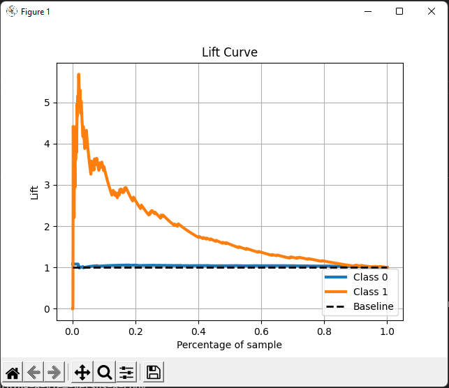
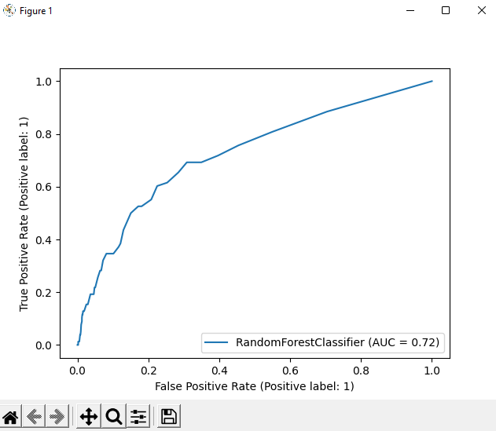
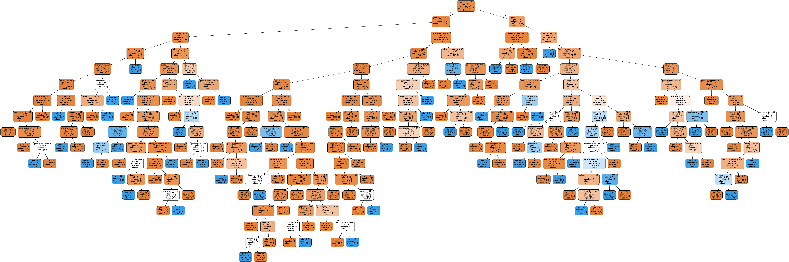
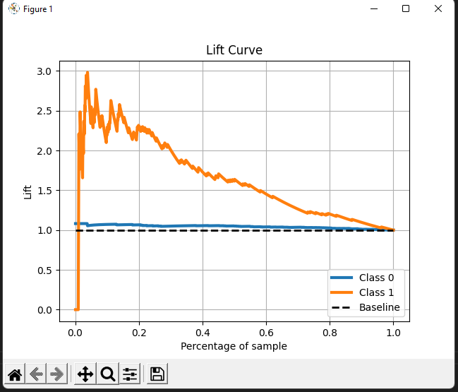
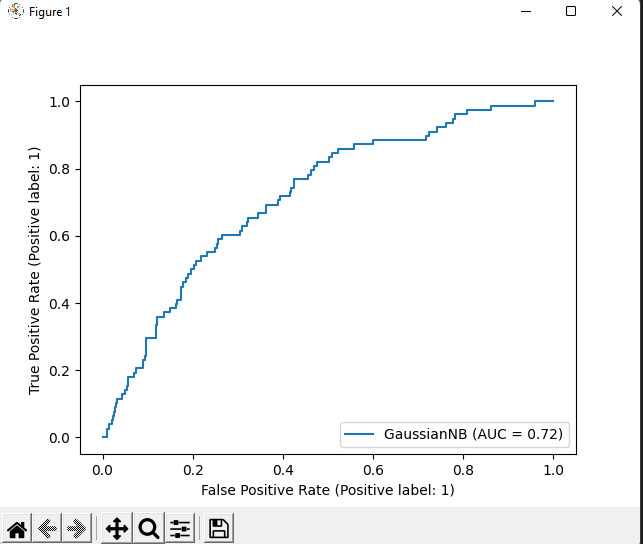

# Projekt BI (NOTATKI BRUDNOPIS)

## Odnośnie tego co jest w wordzie
1. Dataset https://archive-beta.ics.uci.edu/ml/datasets/seismic+bumps

2. ilość rekordów: 2584   
   ilość atrybutów: 18 + 5 dodatkowo skonstruowanych na podstawie istniejących atrybutów + klasa
   
3. są skonstruowane, opisane razem ze wszystkimi atrybutami

4. skorzystano z lasów losowych, oraz Gaussian Naive Bayes. Miary klasyfikacji wypisują się w konsoli po odpaleniu
   (najlepiej odpalić pare razy i wziąć model z najlepszymi miarami)

5. python

6. opis atrybutów na dole

## Przykładowe wyniki
### Random Forest
Classification report
```
               precision    recall  f1-score   support

           0       0.93      1.00      0.96       956
           1       0.20      0.01      0.02        78

    accuracy                           0.92      1034
   macro avg       0.56      0.50      0.49      1034
weighted avg       0.87      0.92      0.89      1034
```
Confusion matrix   
 [[952   4]   
 [ 77   1]]

Accuracy
 0.9216634429400387

Specificity
 0.99581589958159

Sensitivity
 0.01282051282051282

Lift Curve   


ROC   


Drzewo klasyfikacyjne (jedno ze 100 drzew wykorzystanych w lesie)



### Gaussian Naive Bayes
Classification reporty
```
               precision    recall  f1-score   support

           0       0.93      0.94      0.93       956
           1       0.19      0.18      0.18        78
    accuracy                           0.88      1034
   macro avg       0.56      0.56      0.56      1034
weighted avg       0.88      0.88      0.88      1034
```
Confusion matrix
 [[895  61]
 [ 64  14]]

Accuracy
 0.879110251450677  

Specificity
 0.9361924686192469

Sensitivity
 0.1794871794871795

Lift Curve   


ROC   



## Co to ten .arff
W pliku .arff jest opisane na czym polega ten dataset.

## Instrukcja odaplenia
1. potrzebny jest Python3 (używany był 3.8)
2. wejść w konsoli do katalogu projektu i odpalić ```pip install -r ./requirements.txt```
3. ```python main.py``` i powinno się odpalić


## Opis datasetu i atrybutów
ilość rekordów: 2584   
ilość atrybutów: 18 + 5 dodatkowo skonstruowanych na podstawie istniejących atrybutów + klasa
   

dystrybucja klasy:  
    zagrożenie 1 - 170 (6,6%)   
    brak zagrożenia 0 - 2414 (93,4%)

 
 1. seismic - wynik zagrożenia sejsmicznego otrzymany za pomocą metod sejsmicznych
    a - brak zagrożenia 0   
    b - małe zagrożenie 1   
    c - wysokie zagrożenie 2   
    d - najwyższe zagrożenie 3   

2. seismoacoustic - wynik zagrożenia sejsmicznego otrzymany za pomocą metod sejsmiczno akustycznych
    a - brak zagrożenia 0   
    b - małe zagrożenie 1   
    c - wysokie zagrożenie 2   
    d - najwyższe zagrożenie 3   
 
3. shift - typ zmiany    
    W - wydobywająca węgiel 0   
    N - przygotowawcza 1   

4. genergy - sejsmiczna energie nagrana za pomocą najbardziej aktywnego geofonu  

5. gpuls - ilość pulsów nagranych przez najbardziej aktywny geofon

6. gdenergy - odchylenie energii zarejestrowanej przez najbardziej aktywny geofon od średniej zarejestrowanej energi 
podczas ostatnich ośmiu zmian

7. gdpuls - odchylenie  ilości zarejestrowanych pulsów przez najbardziej aktywny geofon od średniej ilości
zarejestrowanych pulsów podczas ostatnich ośmiu zmian

8. ghazard - zagrożenie sejsmiczne zarejestrowane przy pomocy wyłącznie najbardziej aktywnego geofonu z wykorzystaniem metod sejsmiczno akustycznych   
    a - brak zagrożenia 0   
    b - małe zagrożenie 1   
    c - wysokie zagrożenie 2   
    d - najwyższe zagrożenie 3   


9. nbumps - ilość zarejestrowanych wstrząsów sejsmicznych 

10. nbumps2 - ilość zarejestrowanych wstrząsów sejsmicznych w zakresie energii od 10^2J do 10^3J

11. nbumps3 - ilość zarejestrowanych wstrząsów sejsmicznych w zakresie energii od 10^3J do 10^4J

12. nbumps4 - ilość zarejestrowanych wstrząsów sejsmicznych w zakresie energii od 10^4J do 10^5J

13. nbumps5 - ilość zarejestrowanych wstrząsów sejsmicznych w zakresie energii od 10^5J do 10^6J

14. nbumps6 - ilość zarejestrowanych wstrząsów sejsmicznych w zakresie energii od 10^6J do 10^7J

15. nbumps7 - ilość zarejestrowanych wstrząsów sejsmicznych w zakresie energii od 10^7J do 10^8J

16. nbumps89 - ilość zarejestrowanych wstrząsów sejsmicznych w zakresie energii od 10^8J do 10^9J

17. energy - suma energii wstrząsów sejsmicznych 

18. maxenergy - energia najsilniejszego wstrząsu sejsmicznego

---
### Atrybuty dodatkowo skonstruowane na podstawie  istniejących atrybutów

19. genergygpuls -  stosunek genergy do gpuls

20. gdenergydgpuls -  stosunek stosunek dgenergy do gdpuls

21. avgseismic -  średnia wartości seismic i seismoacoustic

22. energygpuls -  stosunek energy do gpuls

23. energynbumps -  stosunek energy do nbunmps

---

24. class - atrybut decyzyjny
    1 - zagrożenie podczas następnej zmiany, wystąpią wstrząsy sejsmiczne o wysokiej energii (> 10^4J)
    0 - brak zagrożenia podczas następnej zmiany, nie wystąpią wstrząsy sejsmiczne o wysokiej energii
